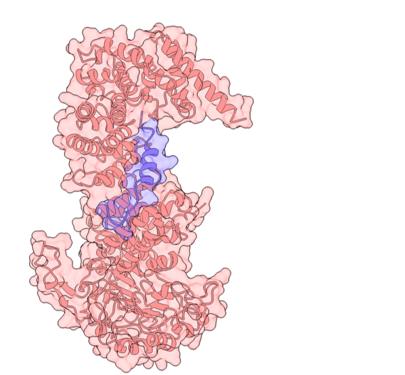

#  AlphaFold Interactions Detector 

## Introduction
This application is designed to detect and visualize protein interactions based on the confidence probabilities provided by the AlphaFold3 model. It allows users to deeply understand the complex interactions between proteins, which is crucial for various biological and medical research.

## About AlphaFold3

AlphaFold3 is a state-of-the-art protein structure prediction tool developed by DeepMind. It uses deep learning techniques to predict the three-dimensional structures of proteins based purely on their amino acid sequences. This technology represents a significant breakthrough in the field of bioinformatics, offering high accuracy predictions that were previously not possible without experimental methods such as X-ray crystallography or NMR spectroscopy.

The technology behind AlphaFold is based on the use of deep neural networks that model the spatial relationships between amino acids in a protein. By predicting the distance and angles between pairs of amino acids, AlphaFold can construct a highly accurate 3D model of a protein’s structure. This capability is crucial for understanding protein function and interaction, which has far-reaching implications for drug discovery, disease understanding, and biological research.

### Importance in This Application
In the context of this application, AlphaFold's predictive power enables the detailed analysis and visualization of protein interactions. By leveraging AlphaFold's outputs, this app assists researchers and scientists in exploring protein structures and interactions more efficiently, enhancing their ability to hypothesize and draw meaningful conclusions about biological processes.

## Usage Instructions
**This app support only AlphaFold3.**

### Uploading Data
To use this app, you can either:
1. **Upload a Data File**: Upload the ZIP file containing data directly from the AlphaFold3 server https://alphafoldserver.com/.
2. **Use Stored Data**: Choose from the data already available in the storage if previously uploaded or provided.

### Application Goal
The primary goal of this app is to visualize and identify interactions between proteins. This is achieved by analyzing the probability scores of the model predictions, which helps in understanding the likelihood and strength of these interactions.

### Getting Started
To begin using the app:
1. **Upload your ZIP file** containing the AlphaFold data, or select from the existing datasets.
2. **Navigate through the interface** to view different visualizations and insights about protein interactions.

### Features
- **Data Upload**: Easy upload of your AlphaFold results.
- **Interaction Visualization**: Detailed graphs  and 3D interactive to visualize protein interactions.
- **Probability Analysis**: Analysis based on the confidence levels provided by AlphaFold predictions.

## link to streamlit:
https://alpha-interactions.streamlit.app/

We hope you find this tool helpful in your research endeavors!
